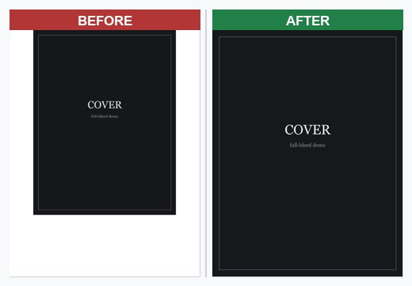
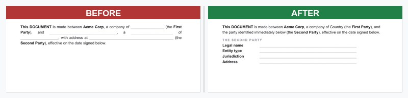
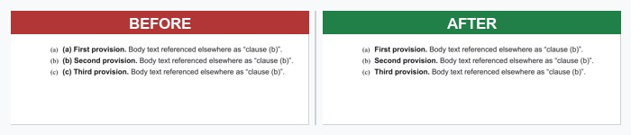

# docx-pdf-design

A [Claude Code skill](https://docs.claude.com/en/docs/claude-code/skills) for building
**polished, editable Word (`.docx`) documents** — contracts, templates, reports — with
[`docx-js`](https://docx.js.org/) that render correctly in **Microsoft Word, Apple Pages,
and LibreOffice**.

The same `.docx` renders differently in every word processor, and some bugs are
renderer-specific. This skill encodes the fixes for the traps that actually bite, each with a
real before/after, plus a build→render→verify workflow and reusable scripts.

## Why

> "It opened fine in LibreOffice but the footer is jammed in Word and the cover has a white
> border in Pages."

`docx-js` producing a file ≠ the file looking right. This skill turns that pain into a
checklist.

## What's inside

```
docx-pdf-design/
├── SKILL.md                # the skill (pitfalls, fixes, image handling, verify loop)
├── scripts/
│   ├── verify.sh           # build → LibreOffice PDF → rasterize pages
│   ├── extract-text.py     # dump body text (content / cross-ref check)
│   ├── check-refs.py       # list every "see Section X" + dangling schedules
│   ├── check-tabs.sh       # detect literal-tab footers that collapse in Word
│   └── helpers.js          # reusable docx-js builders (cover, header/footer, tables)
├── examples/
│   └── make_demos.js       # generates the before/after proof images
└── assets/                 # before/after screenshots
```

## The fixes, before → after

### 1. Full-bleed cover — `transformation` is pixels @96dpi, not points
`612×792` (points) leaves a white border; `816×1056` (px) fills US Letter.



### 2. Footer tab stops collapse in Word — use `new Tab()`, not `"\t"`
A literal tab in `<w:t>` renders fine in LibreOffice but jams together in Word.


### 3. Justified inline blanks stretch — use a left-aligned labeled block


### 4. Don't re-add auto-numbers — they're invisible to text extraction
Manually prefixing `(a)` on an auto-lettered list yields `(a) (a)`.



## Quick start

```bash
# inside a project that builds a .docx with docx-js
node build.js
scripts/verify.sh "My — Document.docx"   # renders + rasterizes; read the pg-*.jpg
scripts/check-refs.py  _verify/doc.pdf.docx   # (run on the .docx)
scripts/check-tabs.sh  doc.docx
```

Requires: Node + `docx` (`npm i docx`), LibreOffice, Poppler (`pdftoppm`/`pdfinfo`), Python +
Pillow (for image work). Paths in `verify.sh` assume macOS LibreOffice — override with
`SOFFICE=/path/to/soffice`.

## Install as a skill

Copy the folder into your skills directory:

```bash
cp -r docx-pdf-design ~/.claude/skills/
```

Claude Code will surface it automatically when a task involves creating or editing styled
`.docx` files.

## License

MIT — see [LICENSE](LICENSE).
